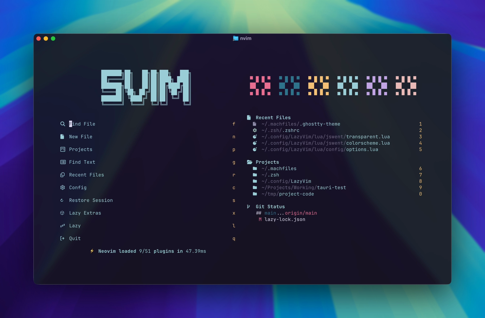

# LazyVim



My personalized Neovim configuration built on top of [LazyVim](https://github.com/LazyVim/LazyVim).

## 🌟 Features

### 🎨 Theme & Appearance

- Dynamic theme system supporting multiple colorschemes:
  - Tokyo Night
  - Gruvbox
  - Rose Pine
- Automatic theme synchronization with terminal (Ghostty)
- Light/Dark mode toggle support
- Transparent background options

### 🛠️ Customizations

- Claude Code integration
- Enhanced winbar configuration
- Custom icons and symbols
- Optimized editor settings
- Language-specific configurations
- Custom keymaps for my workflow
- Additional options and extras via `options.lua`

### 🔌 Plugin Management

- Organized plugin structure:
  - UI enhancements
  - Editor improvements
  - LSP configurations
  - Additional extras
- Custom libraries and (mini) plugins

## 📁 Structure

```
.
├── colors/              # Custom colorschemes
├── lua/
│   ├── config/          # Core configurations
│   │   ├── autocmds.lua # Automatic commands
│   │   ├── keymaps.lua  # Custom keybindings
│   │   ├── lazy.lua     # Lazy.nvim configuration
│   │   └── options.lua  # Neovim options and settings
│   ├── jswent/          # Personal customizations
│   │   ├── extras/      # Optional extra configuration
│   │   │   └── lang/    # Language extras (julia, haskell, etc.)
│   │   ├── claude.lua
│   │   ├── colorscheme.lua
│   │   ├── transparent.lua
│   │   ├── winbar.lua
│   │   └── ...
│   └── plugins/         # Plugin configurations
│       ├── editor.lua
│       ├── lsp.lua
│       ├── ui.lua
│       └── ...
├── init.lua            # Entry point
└── preview.png         # Configuration preview image
```

## 🚀 Getting Started

1. Make sure you have Neovim >= 0.9.0 installed
2. Clone this repository to your configuration directory

   ```bash
   git clone https://github.com/jswent/LazyVim.git ~/.config/LazyVim
   ```

3. Backup your Neovim directory and create a symlink

   ```bash
   ln -s ~/.config/LazyVim ~/.config/nvim
   ```

4. Start Neovim and let Lazy.nvim install all plugins

## ⚙️ Configuration

### Core Settings

The configuration is organized into several key files in the `lua/config/` directory:

- `options.lua`: Core Neovim options and settings
- `keymaps.lua`: Custom keybindings for improved workflow
- `autocmds.lua`: Automatic commands for file types
- `lazy.lua`: Lazy.nvim plugin manager configuration

### Theme Settings

The configuration supports automatic theme synchronization with my terminal (Ghostty) and allows manual theme switching. You can override the theme in `lua/config/options.lua`:

```lua
-- set the colorscheme to gruvbox
vim.g.jswent_colorscheme = "gruvbox"
```

### Transparency Settings

The configuration includes built-in transparency support via the `$TRANSPARENT` environment variable. It's recommended to set this in your terminal emulator. For example, add the following to your shell's configuration:

```shell
export TRANSPARENT=true
```

You can manually control transparency through:

1. Global setting in `lua/config/options.lua`:

   ```lua
   -- Override default transparency detection
   vim.g.jswent_transparent = true -- or false
   ```

2. Commands during runtime:
   - `:EnableTransparent` - Enable transparency
   - `:DisableTransparent` - Disable transparency
   - `:ToggleTransparent` - Toggle transparency state

The transparency settings automatically reload affected plugins and colorschemes to ensure consistent appearance.

### Claude Code Integration

The Claude Code integration opens the TUI in a float using [`Snacks.terminal`](https://github.com/folke/snacks.nvim/blob/main/docs/terminal.md) similar to the default `lazygit` functionality in `LazyVim`. The code can be found in [`jswent/claude.lua`](https://github.com/jswent/LazyVim/blob/main/lua/jswent/claude.lua).

The integration creates two new keymaps for opening the float:

- `<leader>cc`: Claude Code (Root Dir)
- `<leader>cC`: Claude Code (cwd)

> Note: this overrides the default CodeLens keymaps in LazyVim

The integration is only loaded if `claude` is detected on your system, but if you wish to disable it you can use the setting in `options.lua`:

```lua
-- Use this to enable/disable Claude code integration (default true)
vim.g.jswent_claude_enabled = false
```

### Language Extras

The configuration includes specialized language support modules in `lua/jswent/extras/lang/`.

#### Julia

The Julia extra provides LSP integration with custom sysimage support for faster startup. The configuration automatically detects your Julia installation:

1. Checks `JULIA_DEPOT_PATH` environment variable
2. Falls back to `~/.julia` (default depot location)
3. Requires `julia` binary at `{depot}/bin/julia`

**Setup:**

1. Install the required Julia packages in the nvim-lspconfig environment:

   ```bash
   julia --project=~/.julia/environments/nvim-lspconfig -e 'using Pkg; Pkg.add(["LanguageServer", "SymbolServer", "StaticLint", "PackageCompiler"])'
   ```

2. (Optional but recommended) Create a sysimage for faster LSP startup:

   ```bash
   cd ~/.julia/environments/nvim-lspconfig
   julia --project=. -e 'using PackageCompiler; create_sysimage([:LanguageServer, :SymbolServer, :StaticLint]; sysimage_path="julials.so")'
   ```

**Configuration:**

Uncomment the extra in `lua/config/lazy.lua`

```lua
---@type LazyConfig
local opts = {
  spec = {
    -- add LazyVim and import its plugins
    { "LazyVim/LazyVim", import = "lazyvim.plugins" },
    -- import/override with your plugins
    { import = "plugins" },
    -- include extras here
    -- { import = "jswent.extras.lang.essence" },
    { import = "jswent.extras.lang.julia" },
  },
}
```


### Plugin Management

All plugins are managed through Lazy.nvim and can be configured in the `lua/plugins/` directory:

- `ui.lua`: UI-related plugins
- `editor.lua`: Editor enhancement plugins
- `lsp.lua`: Language Server Protocol configurations
- `extras.lua`: Additional plugin configurations

## 📝 License

This configuration is licensed under the same terms as LazyVim. See the [LICENSE](LICENSE) file for details.
